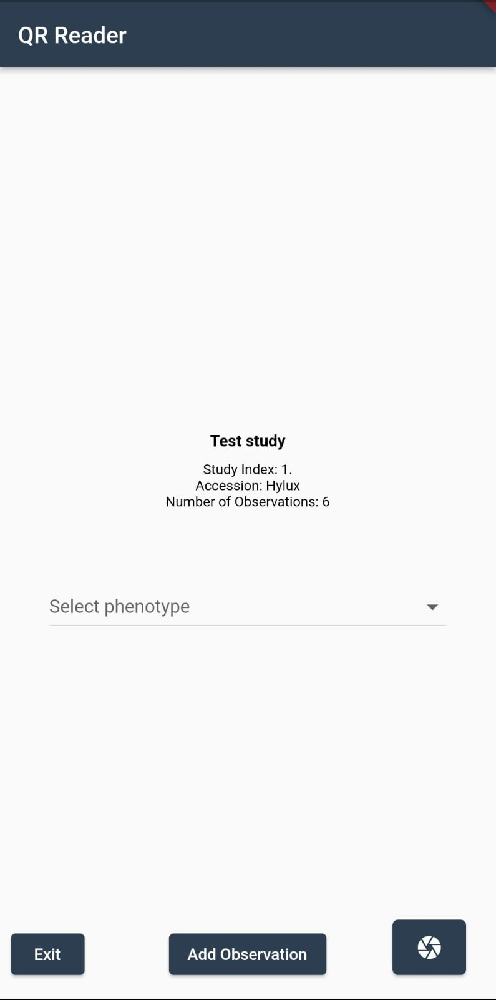
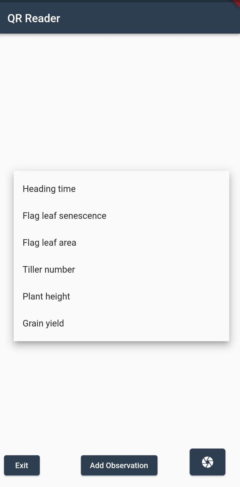
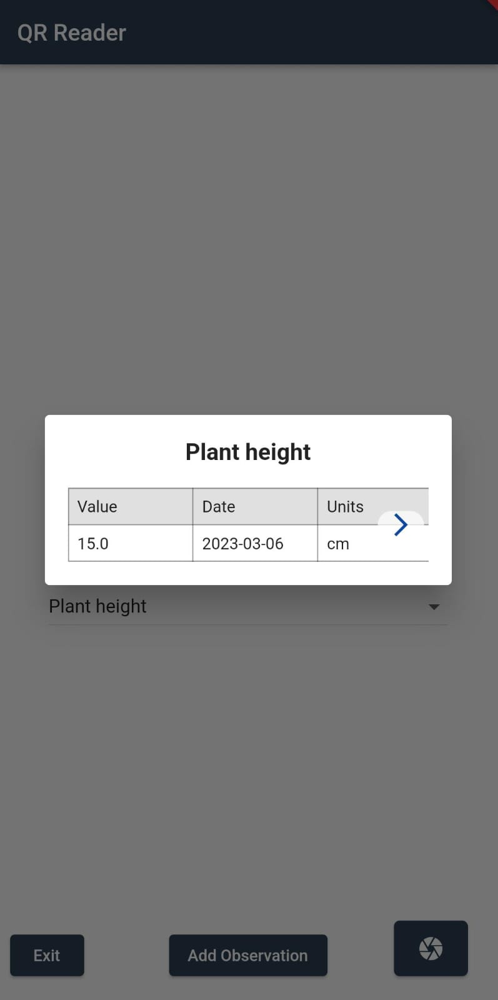
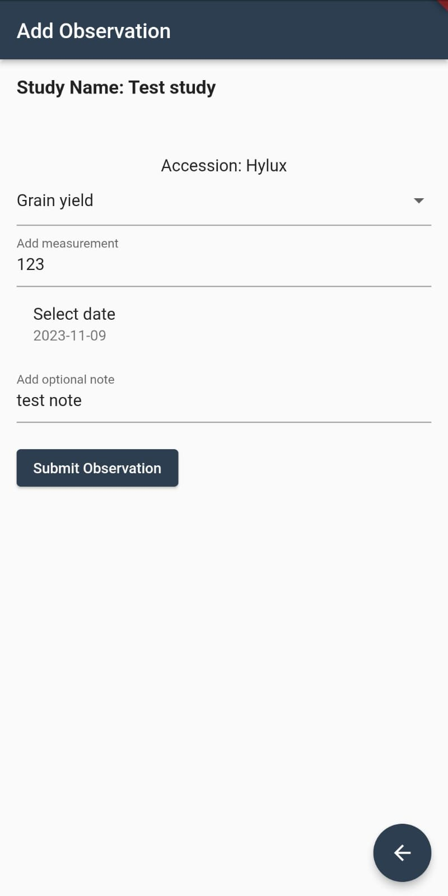
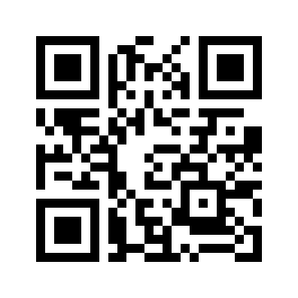

The unique ID for each plot in a study is encoded as a QR code. The app scans the QR code and retrieves the details of a given plot. To start using the app simply open the camera button and point the camera to a QR code. The app will automatically scan the QR code and retrieve the observations, if any, for the plot.

    

To display the observation of a specific phenotype, the user can select the available phenotypes from the dropdown menu. The app will display a table of observations for the selected phenotype.
 
 

    
    

If the plot has no observations, the app will display a message saying that there are no observations for the plot. The user can then enter new observations by clicking on the `Add Observation` button. The app will display a form where the user can enter the details of a new observation. The user can then submit the observation by clicking on the `Submit Observation` button.

 

    

It is possible to submit as many observations as needed for a given plot. Every time an observation is processed the form is reset and the user can enter a new observation. The return button goes back to the previous screen, and if at least one observation was submitted successfully, it will also refresh the tables of observations. 

This a sample QR code for the plot 1 in the test study:

The QR codes for the plots in the test study are available in the [QR_codes](images/QR_codes/QRs.zip) zip file. The QR codes are named after the plot id. For example, the QR code for plot 1 is in the file [1.png](images/QR_codes/1.png).
