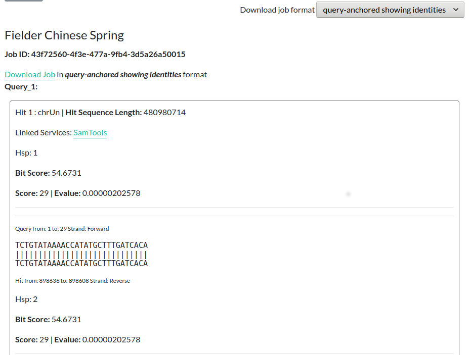

##Introduction

[BLAST](https://blast.ncbi.nlm.nih.gov/Blast.cgi) is a tool by NCBI to find regions of similarity between biological sequences. 
It can compare nucleotide or protein sequences to sequence databases and calculate the statistical significance of how similar they are.

There are currently 3 BLAST Services that can be run within Grassroots:

 * **blastn** for searching nucleotide databases using nucleotide queries.
 * **blastp** for searching protein databases using protein queries.
 * **blastx** for searching protein databases using translated nucleotide queries.

The standard form for entering a BLAST search consists of:

 * **Query Sequence Parameters**: This is the sequence that you wish to search for.

Below this is a list of available databases where you can tick the databases that you wish to search for your query sequence in. Clicking on *Submit* will start running your BLAST searches.

When the job has finished, the page will update to show the matching areas from the database. You can download the results using the *Download Job* link. 
You can change the format that these results are in by selecting a different entry from the *Download job format* menu on the right-hand side of the page.

