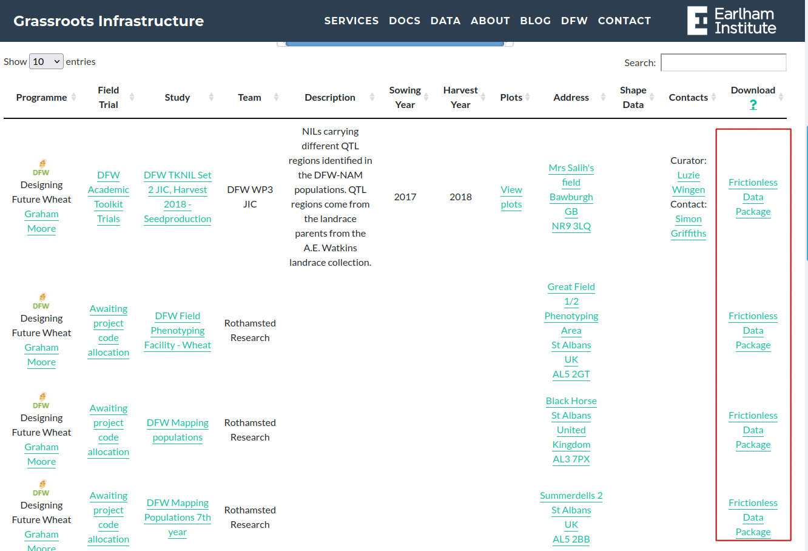

## Downloading Studies

A key idea behind Grassroots is to allow for reuse of data and metadata as seamlessley as possible. 
We have Application Programming Interfaces (APIs) for developers to use, however for users just trying to get all of a study’s data, a simpler solution is needed.
So we have added the ability to download all of the data and metadata for a Study contained in a single file as a [Frictionless Data Package](https://frictionlessdata.io/). 
There are more details available [here](https://grassroots.tools/frictionless-data/).




Once you have downloaded a Study of interest, you can unpack it using the [Grassroots Frictionless Data Tool](https://grassroots.tools/frictionless-data/grassroots-fd-client.md)  


### Example


As an example, we can download the Frictionless Data Package for a Study from the Grassroots Field Trial service and unpack its data. If we use the [DFW TKNIL Set 2 JIC, Harvest 2018 - Seedproduction](https://grassroots.tools/fieldtrial/study/5bcdc979618dc26d682e4a52) Study, we can download its Frictionless data Package from [https://grassroots.tools/frictionless_data_packages/DFW%20TKNIL%20Set%202%20JIC,%20Harvest%202018%20-%20Seedproduction.json](https://grassroots.tools/frictionless_data_packages/DFW%20TKNIL%20Set%202%20JIC,%20Harvest%202018%20-%20Seedproduction.json).
Once we have this file saved, we can run `grassroots_fd_tool` to extract the data from it. 

To run it, getting the data in Markdown format and writing the output files to directory called `studies`, the command would be

```
grassroots_frictionless_data_tool --in "DFW TKNIL Set 2 JIC, Harvest 2018 - Seedproduction.json" --data-fmt markdown --out-dir studies
```

We can check the contents of the directory called `studies`. On Windows you can run `dir` or `ls -l` on Linux to see something similar to the following output:

```
billy@billy-desktop:~/Downloads/studies$ ls -l studies
total 68
-rw-rw-r-- 1 billy billy   713 Jan 24 12:38 Designing_Future_Wheat.md
-rw-rw-r-- 1 billy billy   367 Jan 24 12:38 DFW_Academic_Toolkit_Trials_.md
-rw-rw-r-- 1 billy billy   913 Jan 24 12:38 DFW_TKNIL_Set_2_JIC__Harvest_2018___Seedproduction.md
-rw-rw-r-- 1 billy billy 55188 Jan 24 12:38 DFW_TKNIL_Set_2_JIC__Harvest_2018___Seedproduction___Plots.csv
```

where in this case `Designing_Future_Wheat.md` contains the details of the Programme, `DFW_Academic_Toolkit_Trials_.md` refers to the Field Trial, 
`DFW_TKNIL_Set_2_JIC__Harvest_2018___Seedproduction.md` describes the Study and `DFW_TKNIL_Set_2_JIC__Harvest_2018___Seedproduction___Plots.csv`
is the spreadsheet containing the data for the plots.  
If we take a look at the Study file we see that it contains the study data that has been submitted. For example, running 

```
cat "DFW_TKNIL_Set_2_JIC__Harvest_2018___Seedproduction.md"
```

gives the following output


```
billy@billy-desktop:~/Downloads/studies$ cat studies/DFW_TKNIL_Set_2_JIC__Harvest_2018___Seedproduction.md
# DFW TKNIL Set 2 JIC, Harvest 2018 - Seedproduction

 * **profile** *: [https://grassroots.tools/frictionless-data/schemas/field-trials/study-resource.json](https://grassroots.tools/frictionless-data/schemas/field-trials/study-resource.json)
 * **id**: 5bcdc979618dc26d682e4a52
 * **name** *: DFW TKNIL Set 2 JIC, Harvest 2018 - Seedproduction
 * **location**: Mrs Salih's field
 * **curator_name**: Luzie Wingen
 * **curator_email**: [luzie.wingen@jic.ac.uk](mailto:luzie.wingen@jic.ac.uk)
 * **contact_name**: Simon Griffiths
 * **contact_email**: [simon.griffiths@jic.ac.uk](mailto:simon.griffiths@jic.ac.uk)
 * **description**: NILs carrying different QTL regions identified in the DFW-NAM populations. QTL regions come from the landrace parents from the A.E. Watkins landrace collection.
 * **design**: Two plots per accession in direct vicinity for seed multiplication.
 * **crop**: wheat


## treatments
```
