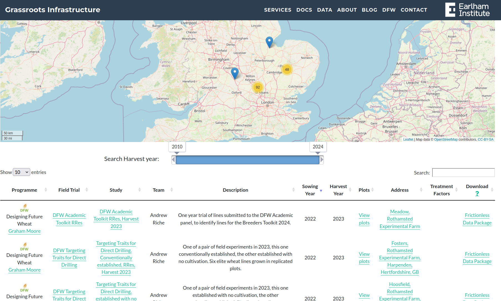
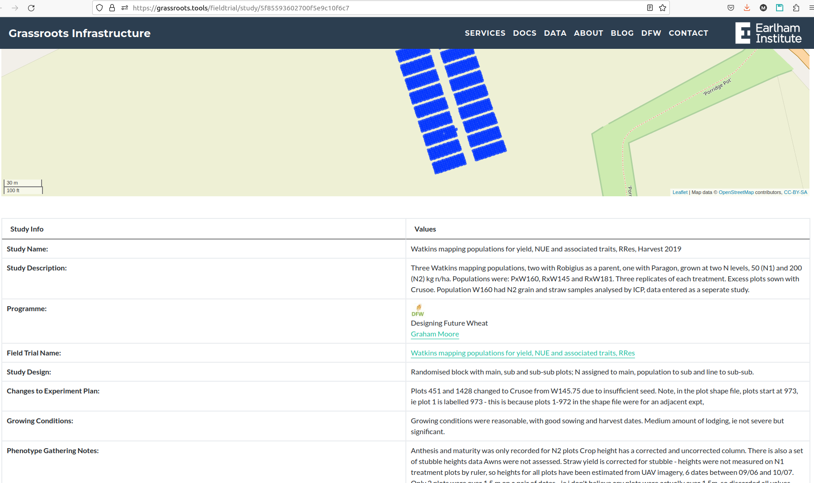

<!--## Field Trial General View-->

The main table listing all the available field trials studies can be access through the following link:
[https://grassroots.tools/fieldtrial/](https://grassroots.tools/fieldtrial/)

The main table provides basic sorting and searching functionalities.

Each row shows basic information about each study, the Programme and the Field Trial its belong to, the name of the study, the year, the location and link to the plot data, if available.

All studies have a Universally Unique Identifier, UUID. Each study can be access using its UUID in this form:

`https://grassroots.tools/fieldtrial/study/<UUID>`.

For example, the study with UUID `5f85593602700f5e9c10f6c7` can be access using the following link: [https://grassroots.tools/fieldtrial/study/5f85593602700f5e9c10f6c7](https://grassroots.tools/fieldtrial/study/5f85593602700f5e9c10f6c7). The study page will show a detailed table with all the information available for the study.
 
 

 

 
