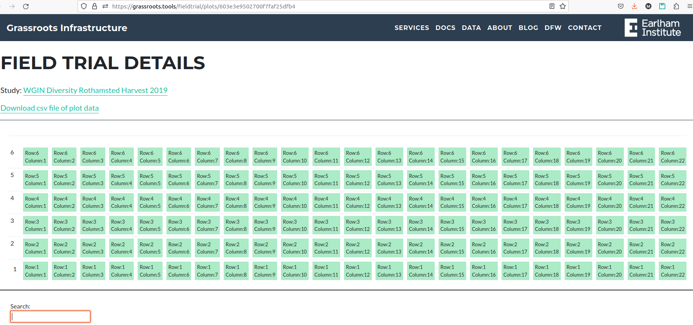
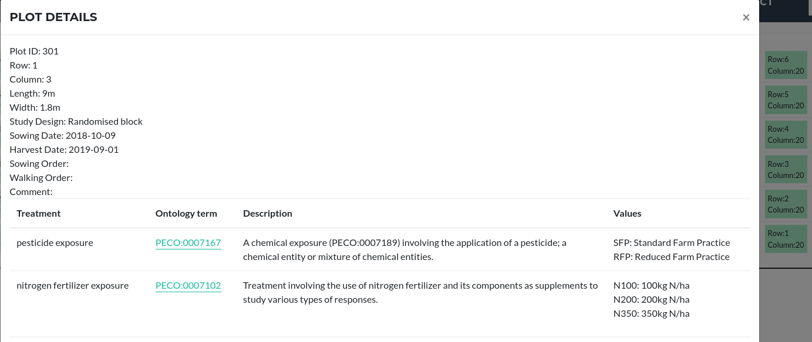
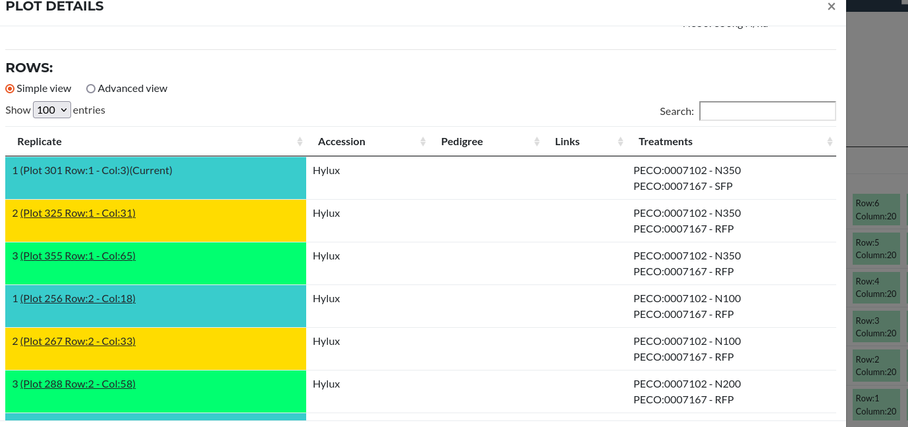
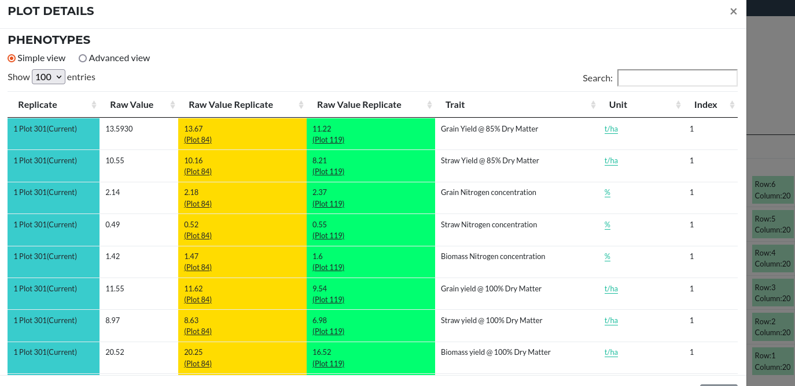

## Plot Data View

When a given study has plot data available, a link will be available in its study  page or directly in the main table of studies. The same UUID from the study can be used to access the plot data in this form:

`https://grassroots.tools/fieldtrial/plots/<UUID>`.

For example, the study with UUID `603e3e9502700f7faf25dfb4` has plot data. The table can be access using the following link: [https://grassroots.tools/fieldtrial/plots/603e3e9502700f7faf25dfb4](https://grassroots.tools/fieldtrial/plots/603e3e9502700f7faf25dfb4)

To display the data of a specific plot, select a plot from the table. A popup window will appear with the plot details. For example, row 1, column 3 will show the next information:

<!--  

From [https://grassroots.tools/fieldtrial/](https://grassroots.tools/fieldtrial/),
select any study to display the its table of general information. 

Click on each of the plot to view detailed information:

   

Plots can be searched by their content from the search section on the right. Currently it is possible to search the crop accessions within the plot. More search functionalities are being added, *e.g.* phenotype search.

  -->
