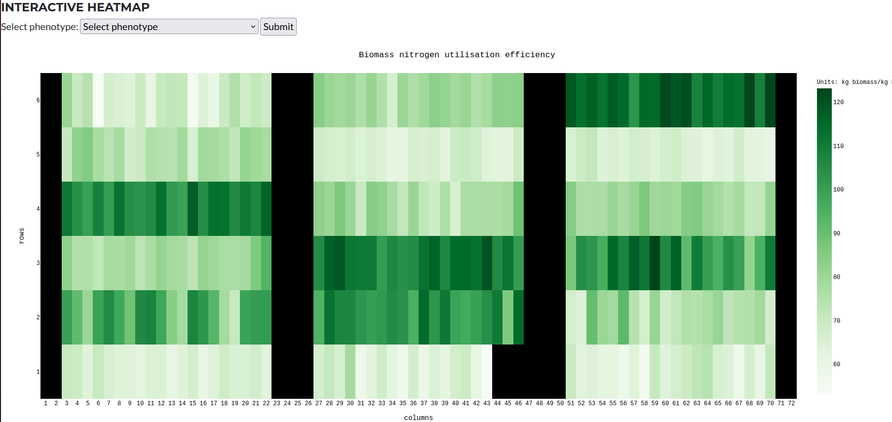
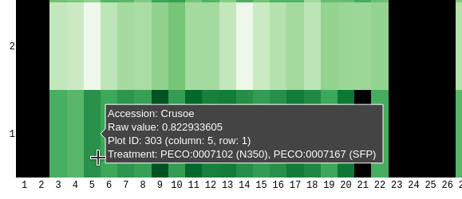

<!--## Heatmaps-->

All plot tables are acompanied by an interactive heatmap. The heatmap shows the plots layout. To load and display the observations of particulpar phenotype in the study, select the phenotype from the dropdown menu. The heatmap will be updated with the selected phenotype.

The heatmap is interactive, the specific phenotype measurement is displayed by simply hovering the mouse over the plot. 

