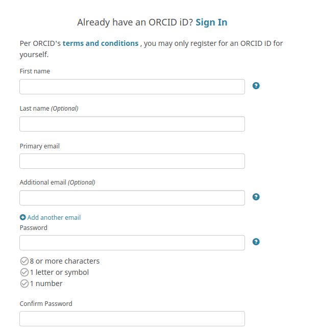
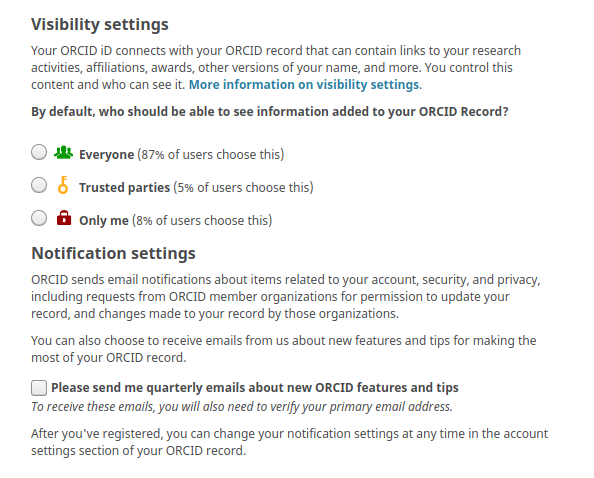
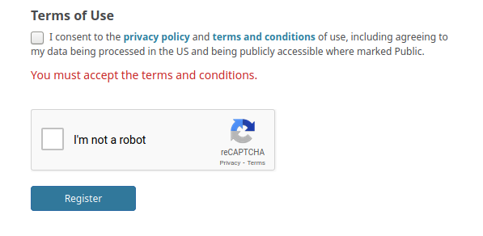

# ORCID and accessing selected Grassroots services and data

Some of the tools and data for Grassroots are only available for authenticated users. This is an attempt to stop anyone accessing the system and potentially corrupting the data or submitting fake results. For example, all of the services at [https://grassroots.tools/private/service](https://grassroots.tools/private/service) require authentication. This document is a guide on how to register with ORCID, the non-profit organisation that aims to uniquely identify researchers in order to track research outputs, funding, etc.

ORCID iDs are becoming commonplace in academic publishing as a mechanism to identify authors, and funding bodies to identify researchers that are associated with grants, for example. The benefits of ORCID is that you will be associated with any data you submit to Grassroots thus getting credit for your work, and you only ever have to sign up once.

To register with ORCID go to [https://orcid.org/signin](https://orcid.org/signin) where you will be presented with a form similar to the one shown in Figure 1. You need to fill in:

 * **First name**
 * **Primary email**
 * **Password**
 * **Confirm Password**

The next stage is to choose who can see your profile in the visibility settings as shown in Figure 2. No private information is shared through ORCID, only information that would usually be publicly available. However, if you are concerned about the visibility of your information, you can choose a more restrictive setting and there is more information available [here](https://support.orcid.org/hc/en-us/articles/360006897614). In any case, any of the visibility settings are fine for the Grassroots authentication to work.

The final part of the form to complete is to tick the **Terms of Use** and **I'm not a robot** boxes and then click on the **Register** button as shown in Figure 3.

Check your email account (especially the spam or clutter folders) for the notice about your account being set up, follow the verification procedure, and then your ORCID is ready to use with the Grassroots system!

You don’t need to do any further registration with us to start submitting or viewing non-public data in our platform as this is all handled by ORCID (much like *Sign in with Google* functionality you see on other websites).

If you have any questions, please email the DFW DCTF mailing list to get help: 

 * Email the DCTF mailing list at <dfw-dctf@googlegroups.com>
 * Post a message to the [DFW Informatics Slack channel](https://dfw-dctf.slack.com/archives/C644S0B1A)

