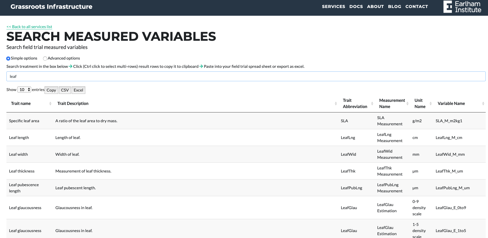

##Search Measured Phenotype Variables

URL: [https://grassroots.tools/public/service/field_trial-search_measured_variables](https://grassroots.tools/public/service/field_trial-search_measured_variables)

As you start to type in the search box, Measured Phenotype Variables
will be returned that match your query.

It is good practice to include these terms to describe your phenotype data wherever possible as the **Variable Name** is unique, and this reduces ambiguity or confusion when describing your phenotype measurements or measurement method. The Measured Phenotype Variables suggested by this service come mainly from [Wheat Crop Ontology]
(https://www.cropontology.org/ontology/CO_321/Wheat) but specialised variables can be added to the system. Please contact the Grassroots team if that is necessary.
This search system allows you to click on a row to copy the Variable Name, which can then be pasted as a column header in your spreadsheet, or any other documentation or publications.

To find which variables are available, start by typing the search phrase into the search box, results will appear below as a table. Select the row and press the copy button. This will copy the variable name of the row will be copied into the clipboard for you to paste into the plots page. 
