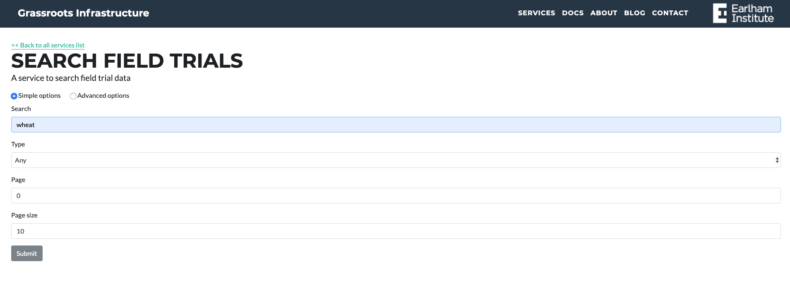
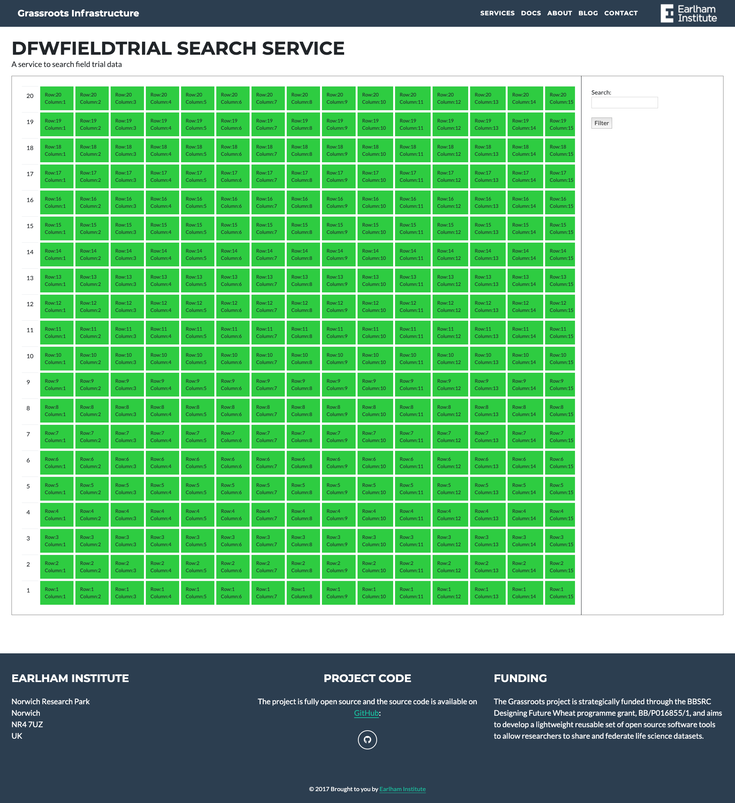
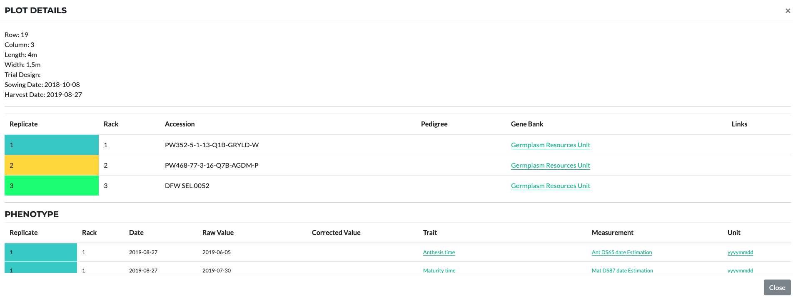

## Field Trial Search Portal

URL: [https://grassroots.tools/public/service/field_trial-search](https://grassroots.tools/public/service/field_trial-search)

The result will be in a table below:

Each Field trial and study can be opened in a new page via the links. They are shown in a map view with details in a tabular format:

There is also a link to display all field trials:
[https://grassroots.tools/public/dynamic/fieldtrial_dynamic.html?type=AllFieldTrials](https://grassroots.tools/public/dynamic/fieldtrial_dynamic.html?type=AllFieldTrials)

##Field Trial Plots View

From the Study page, it is possible to view the plots:

Click on each of the plot to view detailed information:

Plots can be searched by their content from the search section on the right. Currently it is possible to search the crop accessions within the plot. More search functionalities are being added, <i>e.g.</i> phenotype search.

