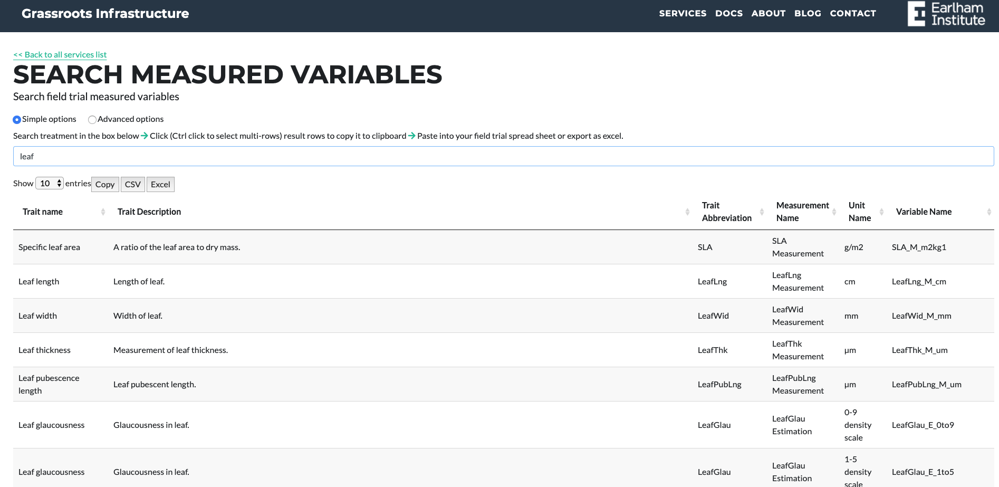

##Search Services

We provide various services that allow you to search across the field trial data.

###Measured Variables

URL: [https://grassroots.tools/public/service/field_trial-search_measured_variables](https://grassroots.tools/public/service/field_trial-search_measured_variables)

As you start to type in the search box, treatments will be returned that match your query. This search system
            allows you to click on a row to copy the **Variable Name**, which can then be pasted as a
            column header in your spreadsheet, or any other documentation or publications. It is good practice to
            include these terms wherever possible as the Variable Name is unique, and this reduces ambiguity or
            confusion when describing your measurements or measurement method.

Start by typing the search phrase into the search box, results will appear below as a table. Select the row
            and press the copy button, the variable name of the row will be copied to the clipboard for you to paste
            into the plots page.
