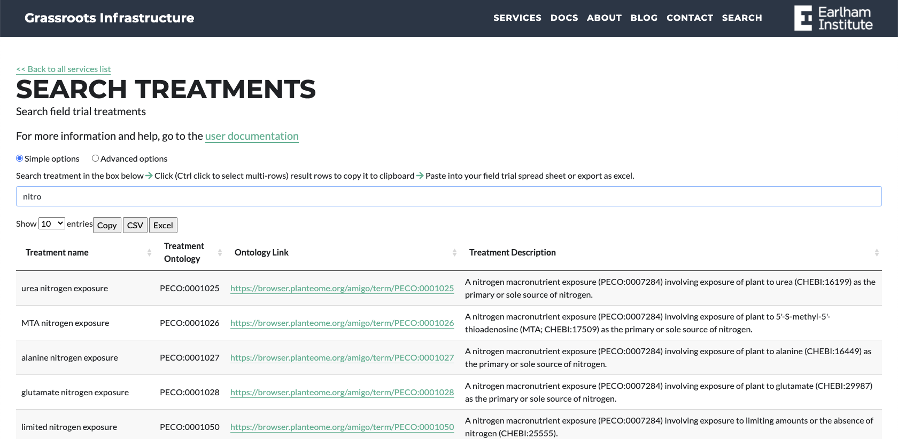

##Search Treatments

URL: [https://grassroots.tools/public/service/field_trial-search_treatments](https://grassroots.tools/public/service/field_trial-search_treatments)

As you start to type in the search box, treatments will be returned that match your query. This search system
            allows you to click on a row to copy the **Treatment Ontology**, which can then be pasted 
            in your spreadsheet, or any other documentation or publications. It is good practice to
            include these terms wherever possible as the Treatment Ontology is unique, and this reduces ambiguity or
            confusion when describing your treatments.
