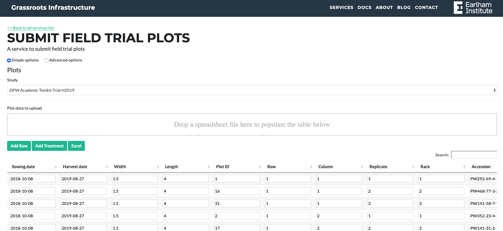
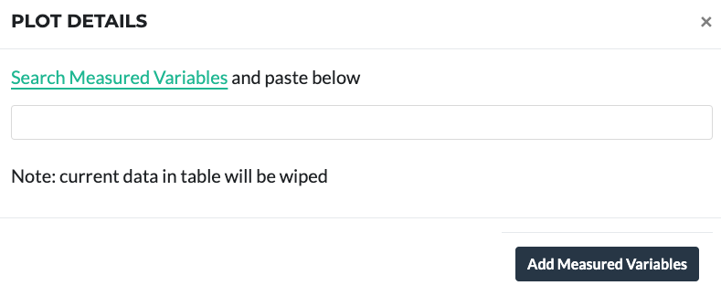
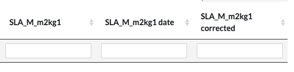

## Submitting Field Trial Plots

The form for submitting or editing existing Plots is available at  [https://grassroots.tools/private/service/field_trial-submit_plots](https://grassroots.tools/private/service/field_trial-submit_plots)

Plots can be added to the study using a table

Firstly, select the study from the drop down menu.

Then the table below will either load the plot info already in the database or showing empty.

The spreadsheet contains:

 * **Sowing date**: Sowing date of the plot. If left blank, then the *Sowing date* specified for the Study will be used. 
 * **Harvest date**: Harvest date of the plot. If left blank, then the *Harvest date* specified for the Study will be used. 
 * **Width**: This is the width, in metres, of each plot. If left blank, then the *Plot width* specified for the Study will be used.   
 * **Length**: This is the length, in metres, of each plot. If left blank, then the *Plot height* specified for the Study will be used.   
 * **Plot ID**: The ID of the plot. This is a number given to uniquely identify each plot in the Study. If GeoJSON and/or images are available, this will be used to identify which plot this information refers to. 
 * **Row**: Row number of the plot. The numbering starts at 1 at the left-hand edge of the plots.
 * **Column**: Column number of the plot. The numbering starts at 1 at the bottom-edge of the plots.
 * **Replicate**: Replicate number of the plot.
 * **Rack**: Rack number of the plot.
 * **Accession**: Accession name. This is the unique identifier from a particular seed/gene bank to identify the material. Currently the Germplasm Resource Unit at the John Innes Centre is the only available seed bank, more will be added in the future, and the value that should be used is what they refer to as the *Accession Name*. For example, for the material detailed [here](https://www.seedstor.ac.uk/search-infoaccession.php?idPlant=39145) the accession name is *PW468-84-1-15-Q2B-MATU-P*.
 * **Comment**: Any comments for the plot.
 * **and measured variables columns**: Extra columns you added with the method below:

To add data or import an Excel file, make sure to add the [Measured Variables](https://grassroots.tools/public/service/field_trial-search_measured_variables)
 first. They can be found
            from the page in the link above, when a Measured Variable is entered in the above popup window (*e.g.*
            SLA_M_m2kg1), three new columns will be created in the table. These three columns are for the phenotypic
            value, the date in YYYY-MMM-DD format that the value was measured and a column for any corrected value that
            is calculated after further analysis. These columns are the name of the Measured Variable, the name followed
            by " date" and the name followed by " corrected". So for our example Measured Variable above, the three
            columns would be: 

- **SLA_M_m2kg1**: This is the raw phenotypic value for SLA_M_m2kg1.
- **SLA_M_m2kg1 date**: This is the date in YYYY-MM-DD format that the value was measured.
- **SLA_M_m2kg1 corrected**: If the value was subsequently adjusted, the updated value is
                placed here. This entry can be blank.
    

Press “Add Row” for each row of the plots to be added with the relevant info, or you can download an Excel file to edit offline.
            

Once completed, a filled Excel file can be imported to the table using the drop zone above the table with the
            heading *Plot data to upload*. The table will then be filled with the information from the uploaded
            Excel file. The spreadsheet columns are matched by the column header name so it is important if a treatment
            is added make sure they are present in the web form’s table too. The import will work without them but those
            columns will be ignored.
