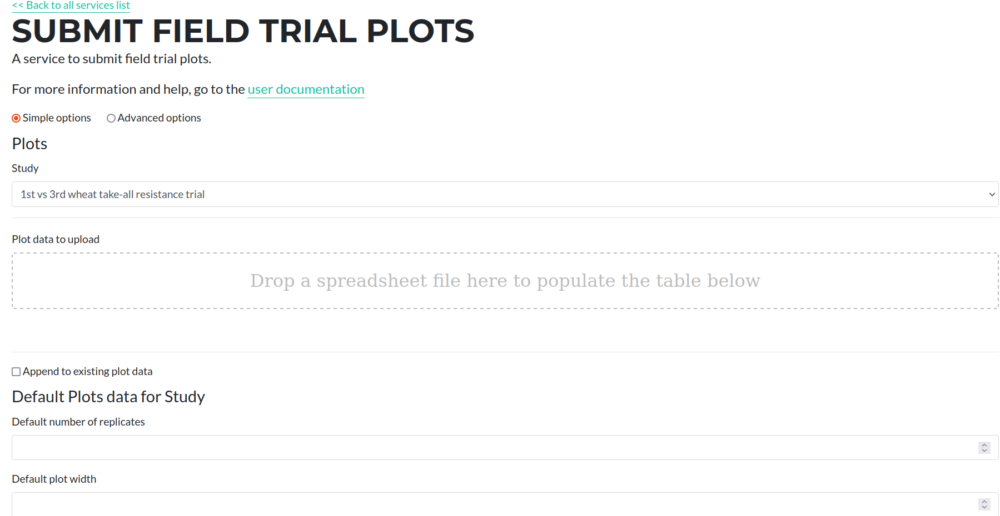
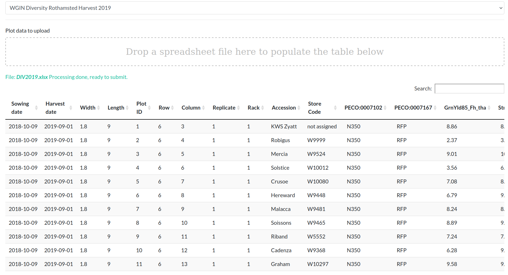
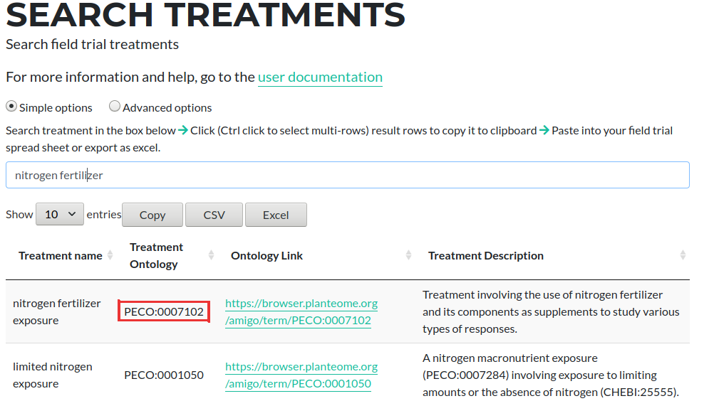

# Submitting Field Trial Plots

The form for submitting or editing existing Plots is available at  [https://grassroots.tools/private/service/field_trial-submit_plots](https://grassroots.tools/private/service/field_trial-submit_plots)

Firstly, select the study that you wish to add the plots for from the drop down menu. The table and form on the page below will load the existing plot information from the database.

Then drag and drop the excel file that constains the plot observations. This will populate the table with the data that will be submitted.

The file should be in the format described below.

## Types of Plots

A Study can contain different categories of plots which are used for a variety of purposes. We currently support the following different types of plots:

 * **Standard**: These are plots where a plant has been grown and one or more phenotypic values have been measured.
 * **Blank**:  A non-existent plot. For instance it can be used in an L-shaped experiment to make a rectangular set of rows and columns. This is specified by adding a column with a heading 
 of _blank_ to the spreadsheet and putting a 1 in the relevant cell for the rows that specify blank plots.
 * **Discard**: A plot where an error renders all data worthless and is ignored by Grassroots. However, data may still be collected, *e.g.* if the plot exists the farm will record a yield.
This is specified by adding a column with a heading of _discard_ to the spreadsheet and putting a 1 in the relevant cell for the rows that specify blank plots.

## Plot details

For all of these different types, there a number of fields some of which are required and some that are optional. These are described below.

### Common Values

Grassroots uses a system where each plot has a unique identifier There are a set of common values that are required for all plots regardless of their type and these are: 

 * **Plot ID** *: The ID of the plot. This is a number given to uniquely identify each rack in the Study similar to a primary key in a database. If GeoJSON and/or images are available, this will be used to identify which plot this information refers to.
 * **Row** *: Row number of the plot. The numbering starts at 1 at the left-hand edge of the plots.
 * **Column** *: Column number of the plot. The numbering starts at 1 at the bottom-edge of the plots.

As well as the required values listed above, there are a number of optional fields which can be applied to all plots and these are listed below.

 * **Width**: This is the width, in metres, of each plot. If left blank, then any *Plot width* specified for the Study when it has been submitted will be used.
 * **Length**: This is the length, in metres, of each plot. If left blank, then any *Plot length* specified for the Study when it has been submitted will be used.
 * **Sowing date**: Sowing date of the plot in the format YYYY-MM-DD. If left blank, then the *Sowing date* specified for the Study when it was submited will be used.
 * **Comment**: Any comments for the plot.
 * **Image**: If there is a full-sized image of this plot, enter the web address of it here. If you need a web address to upload this to, please contact the Grassroots team so we can arrange to host the image.
 * **Thumbnail**: If there is a thumbnail image of this plot, enter the web address of it here. If you need a web address to upload this to, please contact the Grassroots team so we can arrange to host the image.
 * **Sowing order**: The order in which the plots were sown.
 * **Walking order**: The order in which the plots were walked between.

### Standard Plots

For standard plots, the following fields are also required:

 * **Accession** * : This is the unique identifier from a particular seed/gene bank to identify the material. Currently the Germplasm Resource Unit (GRU) at the John Innes Centre is the only available seed bank, more will be added in the future, and the value that should be used is what they refer to as the *Accession Name*. 
For example, for the material detailed [here](https://www.seedstor.ac.uk/search-infoaccession.php?idPlant=39145) the accession name is *PW468-84-1-15-Q2B-MATU-P*. If the accession can be found in the GRU, it will change the background colour to green otherwise it will be blue.
 * **Rack** *: For the Plot at the given Row and Column, this is the number of the cassette that is filled with the material to sow before drilling.

As well the required fields listed above

 * **Harvest date**: Harvest date of the plot in the format YYYY-MM-DD. If left blank, then the *Harvest date* specified for the Study will be used.
 * **Replicate**: Replicate number for this sample. This field can also have *control* to denote an experimental control sample.

\* denotes the required values for each row in the spreadsheet.

## Treatment Factors

Treatment Factors are metadata that specify pieces of information such as the level of Nitrogen fertilizer used on a given plot and these can be added as extra columns within the spreadsheet. To specify the Treatment Factors to add search for the terms you want on the [Search Treatment Factors](https://grassroots.tools/docs/user/services/field_trial/search_treatments.md) page. The column headers that you need to put in the spreadsheet are the *Treatment Ontology* values from there.

For example, if you wanted to add *Nitrogen fertilizer exposure* as a Treatment Factor to the spreadsheet, you would search at the above page and get a similar view to the screenshot below

Copy the value from the *Treatment Ontology* column, which in this example is *PECO:0007102* and add this as a column header to the plots spreadsheet

### Measured Variables

Measured Variables are the terms used to describe phenotypic experimental values that have been measured on a given plot. Similar to the approach of adding Treatment Factors described above these can be added as extra columns as follows:

To add data, make sure to add the [Measured Variables](https://grassroots.tools/service/field_trial-search_measured_variables) first. 
They can be found from the page in the link above. 

The first value in any of the column headers that you add must be the name of the Measured Variable. You can then add extra text to these headers to specify a date that the observation applies too and whether the values in this column are corrected, rather than raw, values. If the value was measured on a single date, then you can add a date here.  Likewise if the measurements were taken over a range of days, you can specify both a start and an end date. These dates can be in one of two formats: one for a day and one for a specfic time on a day.

For dates that refer to a day the format is **YYYY-MM-DD**, where *YYYY* is the 4-digit year, *MM* is the 2-digit month and *DD* is the 2-digit day of the month. If you wish to specify a time as well then the format is **YYYY-MM-DDThh:mm:ss** where *hh* is the 2-digit hour, *mm* is the 2-digit minute and *ss* is the 2-digit second.

As well as adding dates you can also specify whether the values in the given column are raw or corrected values. By default, the values within a column are assumed to be raw values. You can change these to corrected values by adding *corrected* (all lower case) within the column header. 

You can also store multiple data points for a given trait in a given plot, for example plant heights from 5 different points within a plot. This is done by adding **sample_n** within the column header where *n* is a number starting starting from 1 and going on to 2, 3, 4, *etc.* as needed. When this is omitted, samples have a default index of 1.

Some examples are given below:

| Column | Description |
| -- -| --- |
| **PH_M_cm** | Plant height on unspecified date|
| **PH_M_cm 2020-12-01** | Plant height measured on 01 Dec 2020 |
| **PH_M_cm 2020-12-01 2020-12-03** | Plant height measured on 01 Dec 2020 to 03 Dec 202|
| **PH_M_cm corrected** | Plant height corrected value on unspecified date|
| **PH_M_cm 2020-12-01T09:30:00** | Plant height measured on at 9:30 AM on 01 Dec 2020|
| **PH_M_cm 2020-12-01T09:30:00 2020-12-03T12:15:30** | Plant height measured from 9:30 AM 01 Dec 2020 to 12:15:30 PM on 03 Dec 2020|
| **PH_M_cm 2020-12-01T09:30:00 corrected** | Corrected plant height measured on at 9:30 AM on 01 Dec 2020|
| **PH_M_cm 2020-12-01T09:30:00 2020-12-03T12:15:30 corrected** | Corrected plant height measured from 9:30 AM 01 Dec 2020 to 12:15:30 PM on 03 Dec 2020|
| **PH_M_cm 2020-12-01T09:30:00 sample_1** | A sample Plant height measured on at 9:30 AM on 01 Dec 2020 to be stored with an index of 1|
| **PH_M_cm 2020-12-01T09:30:00 sample_2** | A sample Plant height measured on at 9:30 AM on 01 Dec 2020 to be stored with an index of 2|

