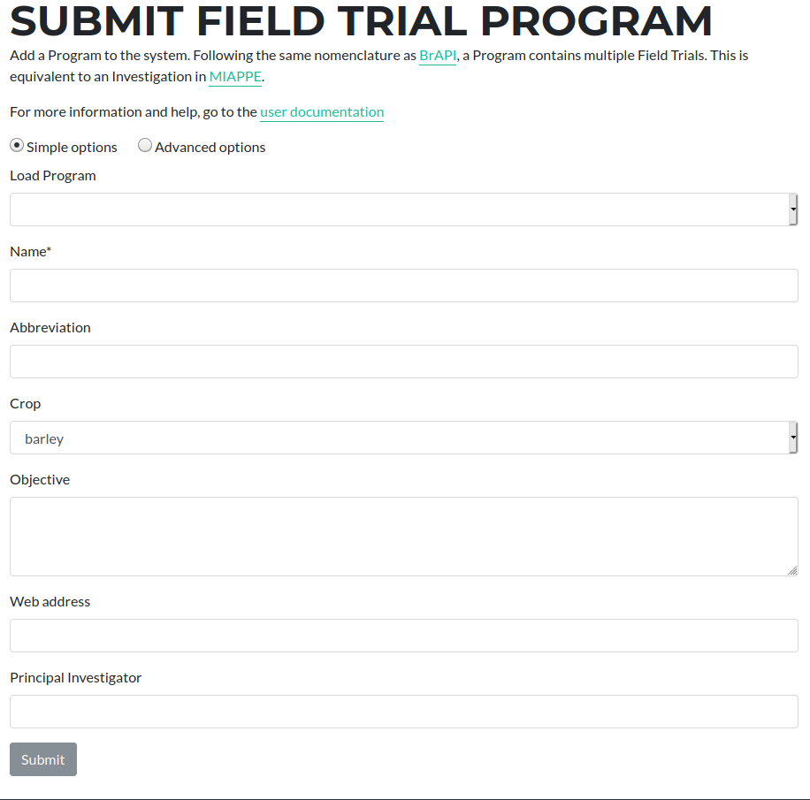

## Submitting Program

Trials can consist of one or more experimental studies.  The form for submitting or editing an existing Program is available at [https://grassroots.tools/private/service/field_trial-submit_program](https://grassroots.tools/private/service/field_trial-submit_program "Submit Program service")

 * **Load Program**: If you wish to edit an existing Program, choose it from this list and its values will be loaded.

A Program consists of the following pieces of information

 * **Name** *: The name of the Program.
 * **Abbreviation**: An abbreviation for the Program.
 * **Crop** *: This is the crop that this Program is investigating.
 * **Objective** *: This is a description of the objectives of the Program.
 * **Web address**: If there is a web page associated with this Program, you can enter it here.
 * **Principal Investigator** *: This is the name of lead person for this Program.

