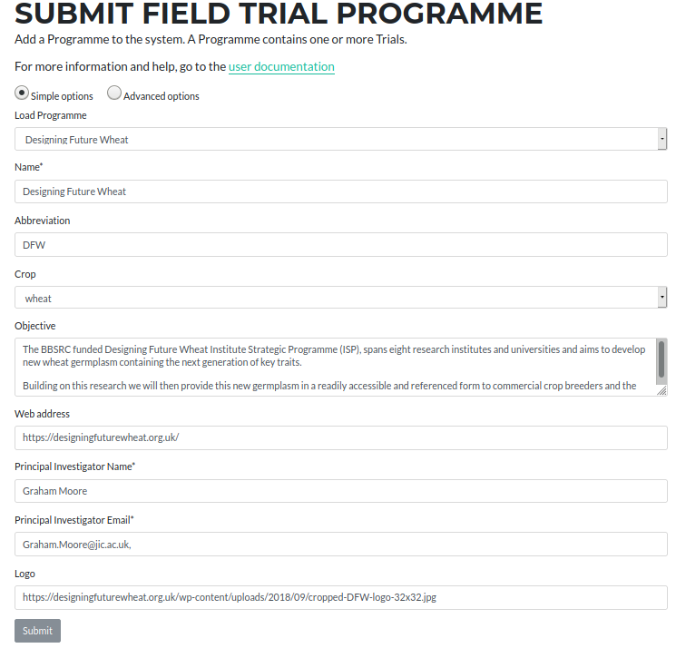

## Submitting Programme

Programmes consist of one or more Field Trials.  The form for submitting or editing an existing Programme is available at [https://grassroots.tools/private/service/field_trial-submit_programme](https://grassroots.tools/private/service/field_trial-submit_programme "Submit Programme service")

 * **Load Programme**: If you wish to edit an existing Programme, choose it from this list and its values will be loaded.

A Programme consists of the following pieces of information

 * **Name** *: The name of the Programme.
 * **Abbreviation**: An abbreviation for the Programme.
 * **Crop**: This is the crop that this Programme is investigating.
 * **Objective**: This is a description of the objectives of the Programme.
 * **Web address**: If there is a web page associated with this Programme, you can enter it here.
 * **Principal Investigator** *: This is the name of lead person for this Programme.

