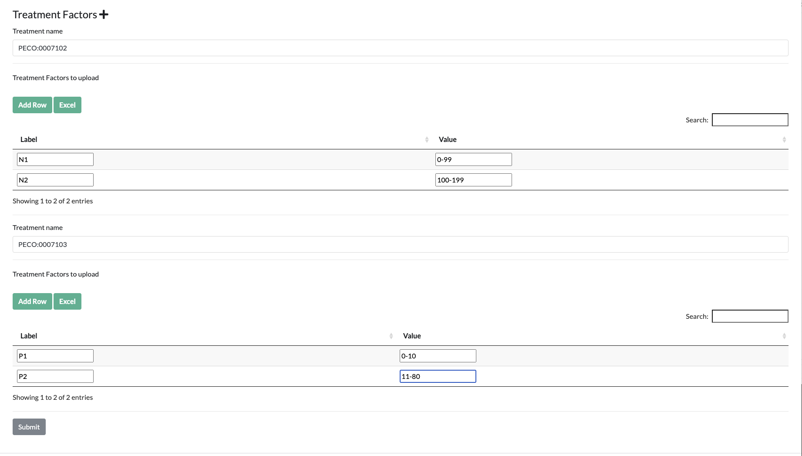

## Submitting Studies

The form for submitting or editing an existing Study is available at [https://grassroots.tools/private/service/field_trial-submit_study](https://grassroots.tools/private/service/field_trial-submit_study).

A Study is an experiment that takes place at a location to measure a variety of phenotypes. It is one of the
main forms that you will need to complete and has a number of fields:

 * **Load Study**: If you wish to edit an existing Study, choose it from this list and its values will be loaded.
 * **Name** *: The name of the Study.
 * **Field Trial** *: This is the Field Trial that this Study belongs to. If the Field Trial
      that you require is not in this list, then you’ll need to create it by following the instructions for
      [creating a Field Trial](submit_trial.md).
 * **Location** *: This is the Location where the Study is taking place. If the Locations that
      you require is not in this list, then you’ll need to create it by following the instructions for
       [creating a Location](submit_location.md) 
 * **Sowing date**: This is the date when the seeds are shown in the field.
 * **Harvest date:** This is the date when the crops are harvested. The plots data can be
      entered at the drilling stage in which case this field can be left blank.
 * **Description**: This is a free-text field where a general description of this Study can be
      defined.
 * **Growing Conditions**: This is a free-text field where any notes about the growing
      conditions for this Study can be placed.
 * **Design**: This is a free-text field where any notes about the experimental design of this
      Study can be set. 
 * **Phenotype gathering notes**: This is a free-text field where any notes about the
      collection of phenotypes for this Study can be set.
 * **Weather**: If there is a system with the weather details for this Study, enter the web
      page for it here.
 * **Plan changes**: This is a free-text field where any notes for changes between the original
      plan and the sowing can be detailed.
 * **Data not included**: This is a free-text field where any notes about omitted data can be added.
 * **Physical samples collected**: This is a free-text field where any details about the physcial samples that were collected can be added.
 * **Crop**: This is the crop that has been sown for this Study. If the required crop is
      missing, please contact us to make it available in the system.
 * **Previous crop**: This is the crop that was previously sown in the field that this Study
      is in. If the required crop is missing, please contact us to make it available in the system. 
 * **pH minimum**: If the pH levels of the soil are known, enter the minimum value here.
 * **pH maximum**: If the pH levels of the soil are known, enter the maximum value here.
 * **Soil**: This is a free-text field to give any details about the soil condition for the
      Study
 * **Link**: If there is a web page relating to this Study with more information that will be
      of interest to users, it can be specified here.
  * **Plots GPS**: If you have a GeoJSON file with the layout of the plots within the field, you can submit it here.
    To map the plots defined in this Study to the shapes in this file, we have a value called *plot_id* which is set
    to the id of the relevant plot. For instance the following snippet has the shape details for *plot_id* of 60 which 
    refers to the plot with *Plot ID* of 60 in the table uploaded when 
    [submitting plots](https://grassroots.tools/docs/user/services/field_trial/submit_plots.md).

``` {.json}
{
	"type": "Feature",
	"properties": {
		"Id": 0,
		"plot_id": 60,
		"BUFF_DIST": -0.2,
		"ORIG_FID": 5
	},
	"geometry": {
		"type": "MultiPolygon",
		"coordinates": [
			[
				[
					[-0.396041480123381, 51.803951709489667],
					[-0.396060782373093, 51.803947819495299],
					[-0.396099327120226, 51.804021327278761],
					[-0.396080024842019, 51.804025217279019],
					[-0.396041480123381, 51.803951709489667]
				]
			]
		]
	}
}
```
 

### Layout

 * **Aspect**: The direction of the plots layout. If this is not known, choose *Unknown*. 
 * **Slope**: The slope of the field.
 
The next set of values take into account the gaps between plots within the field as well as the routes to 
allow tractors to navigate the field and perform the drilling. In the next list of parameters, these groups of
plots between the tractor tracks are referred to as a *block*
 
 * **Horizontal plot gap**: This is the distance, in metres, between each plot within a row.
 * **Vertical plot gap**: This is the distance, in metres, between each plot within a column.
 * **Plot rows per block**: If the layout has spaces to allow for tractors, this is how many rows of plots
there are in each of blocks between the tractor routes.
 * **Plot columns per block**: If the layout has spaces to allow for tractors, this is how many columns of plots
there are in each of blocks between the tractor routes.
 * **Horizontal plot block gap**: This is the distance, in metres, between each block of plots within a row.
 * **Vertical plot block gap**: This is the distance, in metres, between each block of plots within a column.

### Default plot data

To make the plots data easier to enter if you have a standard layout, you can set some default parameters
here and Grassroots will automatically create a partially-completed spreadsheet for plots data for this
Study. The values that can be set are:

 * **Number of plot rows**: How many rows of plots there are in this Study.
 * **Number of plot columns**: How many columns of plots there are in this Study.
 * **Number of replicates**: The number of genotype replicates in this Study. If left blank, it is assumed to be 1.
 * **Plot width**: This is the width, in metres, of each plot.
 * **Plot length**: This is the length, in metres, of each plot.

To automatically generate the spreadsheet of Plot data, at least both of the *Number of plot rows* and
*Number of plot columns* parameters need to be specified. Grassroots will generate a row in the
spreadsheet for each unique possible combination of the row, column and replicate values.

### Treatment Factors

You can specify *Treatment Factors* that are used in this Study so that they can be added to the Plots spreadsheet
data. To begin with find the *Treatments* that you want to use in this Study by using the [Search Treatments](search_treatments.md)
service and put the unique name of the Treatment, it will likely begin with PECO:, into the *Treatment name* box. 
Next you can define the Treatment Factor values that you wish to use in the *Treatment Factors to upload* field.
This is a table with two columns:

* **Label**: This is value that will be put into each row of the spreadsheet in the column that has the unique name of the Treatment
as its heading.
* **Value**: This is the actual value or range of values that the label refers to. 

For example, we could choose [PECO:0007102](http://draco.cyverse.org/amigo/term/PECO:0007102), which is the ontology term defining *nitrogen fertilizer exposure*, as the Treatment that we are 
interested in. Then, in its table of values, we could have 

| Label | Value |
| :---: | :---: |
| N1    | 0-20 mg/L |
| N2    | 21-50 mg/L |
| N3    | 51+ mg/L |


So when [submitting Plots](submit_plots.md), you can have a column in the spreadsheet with PECO:0007102 as the header and either N1, N2 or N3 as the 
values for each Plot entry row.



Press the + button to add a new set of treatment factors, and under each of them press Add Row to add new Labels and Values.
