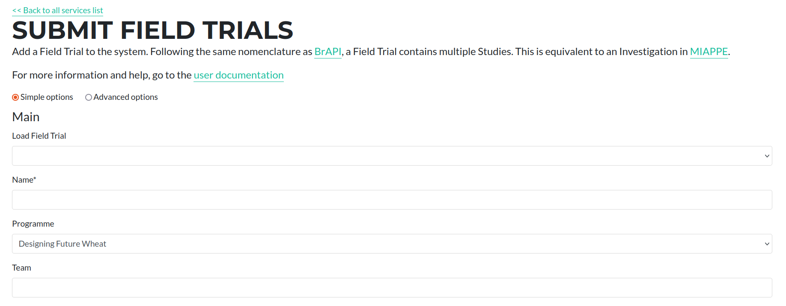
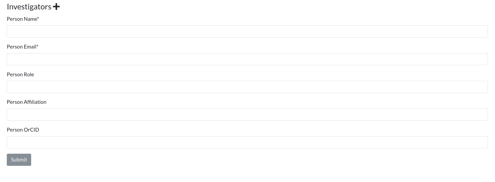

## Submitting Trials

Trials can consist of one or more experimental studies.  The form for submitting or editing an existing Field Trial is available at [https://grassroots.tools/private/service/field_trial-submit_trial](https://grassroots.tools/private/service/field_trial-submit_trial "Submit Field Trial service")

 * **Load Field Trial**: If you wish to edit an existing Field Trial, choose it from this list and its values will be loaded.

A Trial consists of the following pieces of information

 * **Name** *: The name of the Field Trial.
 * **Team**: The team or group that are conducting the Field Trial.
 * **Programme** *: This is the Programme that this Field Trial is a part of.

Addionally, it is possible to add extra information in this level, such a co-Principal Investigator or another relevant leader or contributor.

