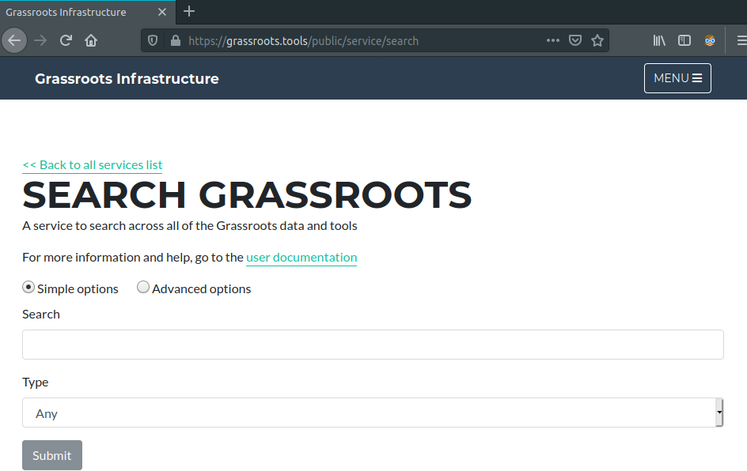

##Introduction

Given that a Grassroots system contains disparate services and a wide variety of data and metadata, it can sometimes be difficult to find the content taht you are interested in. 
To address this, we have created a search service. This has a text box where you simply type in the keywords and this service will search across all of the services, data and metadata within the system and return the relevant results. The service is available at [https://grassroots.tools/public/service/search](https://grassroots.tools/public/service/search).

The basic options present you with a text box where you can type in your query and an option to restrict the results to a particular type. Currently the list of types are 

 * **Any**: Return all hits
 * **Dataset**: Only return matching datatsets on the DFW Data Portal.
 * **Service**: Only return services that either perfrom a function that matches the search term or can act upon some data that matches it. For example, if you searched for Paragin, a BLAST service that had a Paragon database would produce a match here.
 * **Field Trial**: Only return matching Field Trials from the [Field Trial service](https://grassroots.tools/docs/user/services/field_trial/).
 * **Study**: Only return matching Studies from the [Field Trial service](https://grassroots.tools/docs/user/services/field_trial/).
 * **Location**: Only return matching Locations from the [Field Trial service](https://grassroots.tools/docs/user/services/field_trial/).
 * **Measured Variable**: Only return matching Measured Variables from the [Field Trial service](https://grassroots.tools/docs/user/services/field_trial/).
 * **Programme**: Only return matching Programmes from the [Field Trial service](https://grassroots.tools/docs/user/services/field_trial/).

